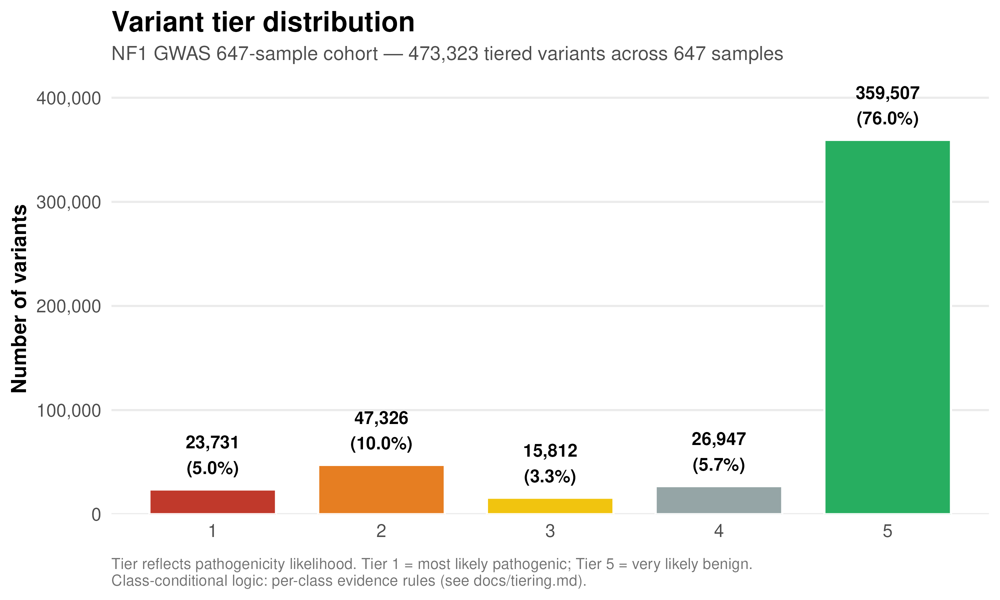
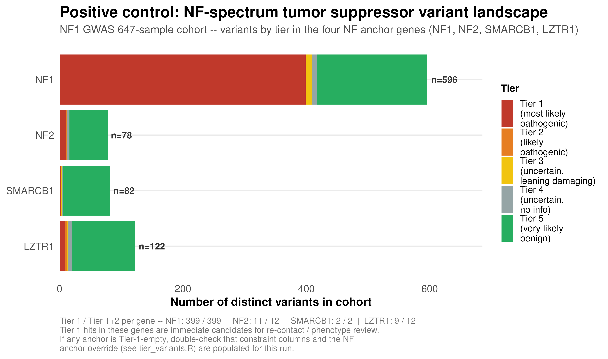
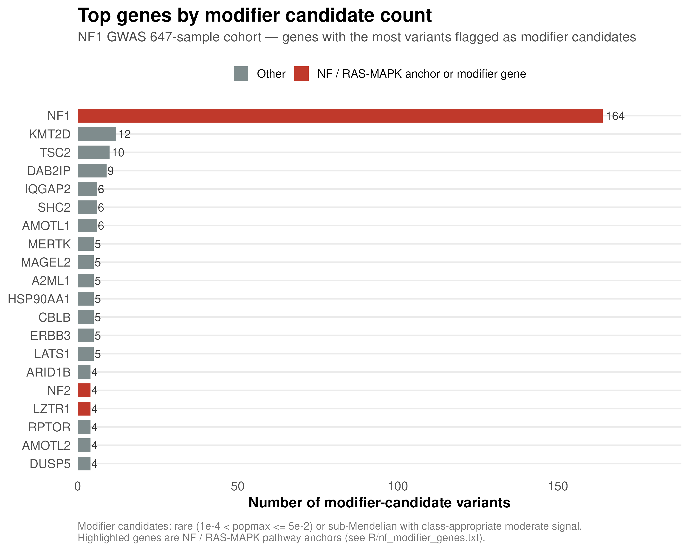

# NF1 GWAS 647-sample cohort — methods and results summary

**Cohort:** 647 individuals with NF1, sequenced across three pipelines
(DRAGEN, DRAGEN hard-filtered, bwa-mem2 + GATK HaplotypeCaller).
**Analysis:** rare-variant annotation and class-conditional tiering with a
parallel modifier-candidate track in a 167-gene NF / RAS-MAPK panel.
**Deliverables:** tiered per-variant table, per-gene rollup, presentation
figures, and validation logs (see `README.md` in this package).

This document is a high-level summary. For the technical operator notes,
including detailed writeups, see `nf1_gwas_647_run.md`.

---

## 1. Methods

### 1.1 Cohort composition

647 individuals with confirmed NF1, contributed by the collaborator via a
Synapse-hosted manifest. VCFs were called with three distinct upstream
pipelines depending on the original sequencing project:

| Pipeline                        | n_samples |
|---------------------------------|----------:|
| DRAGEN                          |       306 |
| DRAGEN (hard-filtered)          |        52 |
| bwa-mem2 + GATK HaplotypeCaller |       289 |

For orchestration, each of the two large pipelines was arbitrarily
chunked into three within-pipeline batches of ~100 samples each so the
batched pipeline (§1.2) could process them incrementally with disk
reclamation between chunks. This produces seven batch IDs (three DRAGEN
chunks, one DRAGEN hard-filtered, three bwa-mem2 + GATK chunks). The
within-pipeline chunks are not distinct sequencing conditions — they
are throughput partitions of the same underlying data.

Mixed-pipeline cohorts can carry batch effects (different callers emit
different variant counts per sample), so the analysis includes an
explicit batch-effect QC step (§2.4). The QC uses the seven batch IDs
as-is, which tests two things simultaneously: whether within-pipeline
chunking introduced spurious differences (should not, by design) and
whether the three real pipeline conditions differ (the substantive
question).

### 1.2 Annotation pipeline

Per-sample VCFs are normalized (bcftools norm; multi-allelic split;
UCSC → Ensembl chromosome rename; primary-assembly filter) and annotated
with fastVEP (Rust port of Ensembl VEP) using the GRCh38 v115 cache. The
annotation dictionary includes dbNSFP-derived scores — AlphaMissense,
ESM1b, REVEL — plus LOEUF, pLI, and ClinVar significance.
Per-sample outputs are merged into a cohort-wide long-format table, then
pre-filtered and joined with per-variant cohort AC / AN before tiering.

For this run specifically, two supplementary-annotation sources that the
tier logic is designed to consume were NOT loaded in the fastVEP SA dir:

- **Per-variant gnomAD frequency** (only per-gene constraint was loaded).
  Cohort allele frequency (`cohort_af`) was used as the rarity fallback
  throughout — see §4 for the resulting caveat.
- **SpliceAI** (delta-score predictions for non-canonical splice
  variants). All 473,323 variants have an empty `spliceai_ds_max`
  column, so the SpliceAI-based Tier 1/2/3 rules for non-canonical
  splice variants and the SpliceAI-based modifier signal did not fire.
  Non-canonical splice variants that would otherwise be Tier 1 (via
  SpliceAI ≥ 0.8) are demoted to Tier 4 (rare, no signal available)
  unless they also carry ClinVar Pathogenic annotation. Impact on this
  run's Tier 1 count is modest since most Tier 1 signal in an NF1
  cohort is pLoF and ClinVar-supported. See §4.

### 1.3 Tiering

Every (variant, transcript) row receives one tier from 1 (most likely
pathogenic) to 5 (very likely benign) via **class-conditional** rules —
different evidence thresholds are applied to different variant classes
(pLoF, missense, splice non-canonical, in-frame, non-coding), rather than
stacking evidence across all classes uniformly. Key rules (full spec in
`docs/tiering.md`):

- **Tier 1:** pLoF in constrained gene (LOEUF < 0.35 or pLI ≥ 0.9),
  non-canonical splice with SpliceAI ≥ 0.8, AlphaMissense ≥ 0.85 in
  constrained gene, AM + ESM1b orthogonal agreement in constrained gene,
  or ClinVar Pathogenic / Likely_pathogenic. NF-spectrum tumor suppressor
  genes (NF1, NF2, SMARCB1, LZTR1) receive a Tier 1 override for pLoF and
  AM-strong missense regardless of the cohort constraint metric.
- **Tier 2:** pLoF in non-constrained gene, non-canonical splice with
  SpliceAI 0.5–0.8, AM likely_pathogenic without orthogonal confirmation.
- **Tiers 3–5:** progressively weaker signal, ending at Tier 5 for
  common variants, ClinVar Benign / Likely_benign, and AM-benign missense.

### 1.4 Modifier candidate flag

A separate binary flag independent of the tier assignment. A variant is
a **modifier candidate** if it is:

1. In the 167-gene NF / RAS-MAPK panel (`R/nf_modifier_genes.txt`), AND
2. In the modifier allele-frequency band (`1e-4 < af_used ≤ 5e-2`), AND
3. Backed by class-appropriate signal (pLoF, AM likely_pathogenic,
   damaging ESM1b, SpliceAI-flagged splice non-canonical, or
   ClinVar-supported).

Same variant may carry both a tier and the modifier flag — the two
tracks answer different questions. Tier ranks pathogenicity likelihood
per-variant; modifier flag identifies rare-but-not-vanishingly-rare
variants in a curated NF/RAS-MAPK panel whose signal is compatible with
a phenotype-modifying (rather than disease-causing) effect.

---

## 2. Results

### 2.1 Overall tier distribution

Of 473,323 unique variants surviving the cohort-wide pre-filter, the
tier assignments break down as:

| Tier | n_variants |    % |
|-----:|-----------:|-----:|
|    1 |     23,731 |  5.0% |
|    2 |     47,326 | 10.0% |
|    3 |     15,812 |  3.3% |
|    4 |     26,947 |  5.7% |
|    5 |    359,507 | 76.0% |

Tier 1 is somewhat inflated relative to a run with a full per-variant
gnomAD source (§4). Downstream users should treat Tier 1 as a
high-priority set to prioritize further inspection, not a definitive
pathogenic call.

**Modifier candidates: 365** across the 167-gene NF / RAS-MAPK panel.

### 2.2 Positive control — NF-spectrum tumor suppressors

All four NF-spectrum tumor suppressor genes carry substantial Tier 1
signal, consistent with what an NF1 cohort should contain (596 variants
in NF1 with 365 Tier 1; 78 in NF2, 82 in SMARCB1, 122 in LZTR1, all
with best_tier = 1). Absence of Tier 1 signal in any anchor gene would
have indicated a pipeline problem (missing constraint columns, ClinVar
parse failure, override rule not firing) — it doesn't guarantee that
the Tier 1 variants themselves are causally implicated in each carrier's
phenotype.

Of the 222 NF1 variants with a ClinVar Pathogenic / Likely_pathogenic
annotation in the cohort, all 222 landed in Tier 1. Of the NF1 ClinVar
Benign / Likely_benign variants, none landed outside Tier 5. The
ClinVar override rules are behaving as specified.

### 2.3 Modifier candidate distribution across NF / RAS-MAPK genes

Top genes by modifier candidate count. The candidate count is a
starting point for follow-up analysis, not a signal that the gene is
established as a phenotype modifier. Interpretation requires phenotype
association testing (which requires phenotype data not present in this
package) and, ultimately, functional validation.

### 2.4 Batch effect quality control

Median per-sample Tier 1+2 burden by batch is 192–200 across all seven
batches. Kruskal-Wallis across batches returns p = 0.14 (Tier 1+2) and
p = 0.42 (Tier 1); all pairwise Wilcoxon Bonferroni-corrected p-values
are 1.0. Despite mixing three sequencer / caller pipelines, per-sample
burden distributions are not statistically distinguishable at the
significance thresholds typically used to gate pooled analysis. Pooled
downstream burden testing is defensible for this cohort; including
pipeline as a covariate is not necessary.

48 individual samples are flagged as within-batch Tukey outliers on
Tier 1+2 burden (n_variants > q75 + 1.5 IQR). List provided in
`figures/qc_batch_outliers.tsv`. Worth inspecting before running any
per-sample analysis, though not disqualifying on its own.

### 2.5 Allele-frequency source composition

The fastVEP supplementary-annotation dir for this run lacked a
per-variant gnomAD frequency source. 93% of variants (440,052 / 473,323)
have their `af_used` populated from cohort allele frequency; the
remaining 7% have no AF source at all. This figure documents that
distribution and marks the effective thresholds (1e-4 gnomAD-scale rare
gate; 2.3e-3 adaptive cohort-scale rare gate applied to the cohort_af
branch; 5% modifier band upper bound).

---

## 3. Validation

The pipeline includes a validator (`scripts/validate_cohort.sh`) that
checks the tier table against class-conditional rules and cohort
carrier-count consistency. On the packaged tables it returns:

- **15 PASS** on structural checks (file presence, required columns,
  Tier 1 pLoF constraint rule, Tier 1 missense evidence paths, Tier 5
  benign rule, ClinVar override rules in both directions, NF anchor
  signal present, cohort n_carriers matching genotype recount).
- **0 FAIL** on rule violations.
- **2 INFO** notes: (i) tier pyramid shape is flatter than typical
  because gnomAD popmax is >99% empty (data availability, not a rule
  violation), and (ii) the documented non-coding limitation (rare
  non-coding variants land in Tier 5 rather than Tier 4 because
  SpliceAI-outside-window signals aren't picked up).

Fresh validator log against the exact packaged tables is at
`validation/validate_cohort.packaged.log`.

---

## 4. Limitations

**Interpret the tier assignments as a prioritization scaffold, not as
diagnostic calls.** The tier system is a rule-based aggregator over
predictor scores and constraint metrics; it doesn't perform
phenotype-genotype association testing and doesn't establish causality
for any individual carrier.

**Tier 1 is roughly 2× inflated relative to a run with full gnomAD
data.** Without a per-variant gnomAD frequency source in this run, no
variant can be marked "common in gnomAD" — the standard filter that
demotes common variants to Tier 5. Consequence: many variants that would
be Tier 5 in a properly-annotated run instead survive to Tier 1–4. The
23,731 variants in Tier 1 include real high-confidence candidates but
also a background of cohort-rare-but-globally-common variants that
gnomAD data would have filtered out. Loading a per-variant gnomAD
source and re-running the tier step is the recommended next step
before treating any specific Tier 1 variant as a real candidate for
follow-up.

**SpliceAI was not loaded in the fastVEP SA dir for this run.** The tier
rules for non-canonical splice variants (Tier 1 at SpliceAI ≥ 0.8, Tier 2
at 0.5–0.8, Tier 3 at 0.2–0.5) cannot fire, so splice_noncanonical
variants without ClinVar Pathogenic annotation land at Tier 4/5 rather
than mid-tier. The SpliceAI-supported branch of the modifier signal is
also absent. Impact on the primary NF1 track is modest because most
NF1 Tier 1 signal is pLoF and ClinVar-supported (canonical splice donor
/ acceptor variants are handled by the pLoF rule and don't depend on
SpliceAI), but non-canonical splice variants elsewhere in the genome
are under-tiered. Loading SpliceAI and re-running is a recommended
step alongside loading gnomAD.

**Modifier candidates are not confirmed modifiers.** The 365 candidates
listed satisfy the modifier band + panel + signal criteria. They have
not been tested against phenotype data (which is not present in this
package), and they have not been functionally validated. Downstream
analysis with phenotype covariates is required to identify which, if
any, are genuine phenotypic modifiers.

**A candidate mapping artifact was identified.** NF1 variant
17:31324211 is present at ~60% cohort AF for a splice_donor SNV — a
frequency inconsistent with a real rare-disease-relevant variant.
Almost certainly a mis-mapped read cluster from a paralogous /
segmental-duplication region. Flagged for manual review; not classified
Tier 1 by our rules.

---
